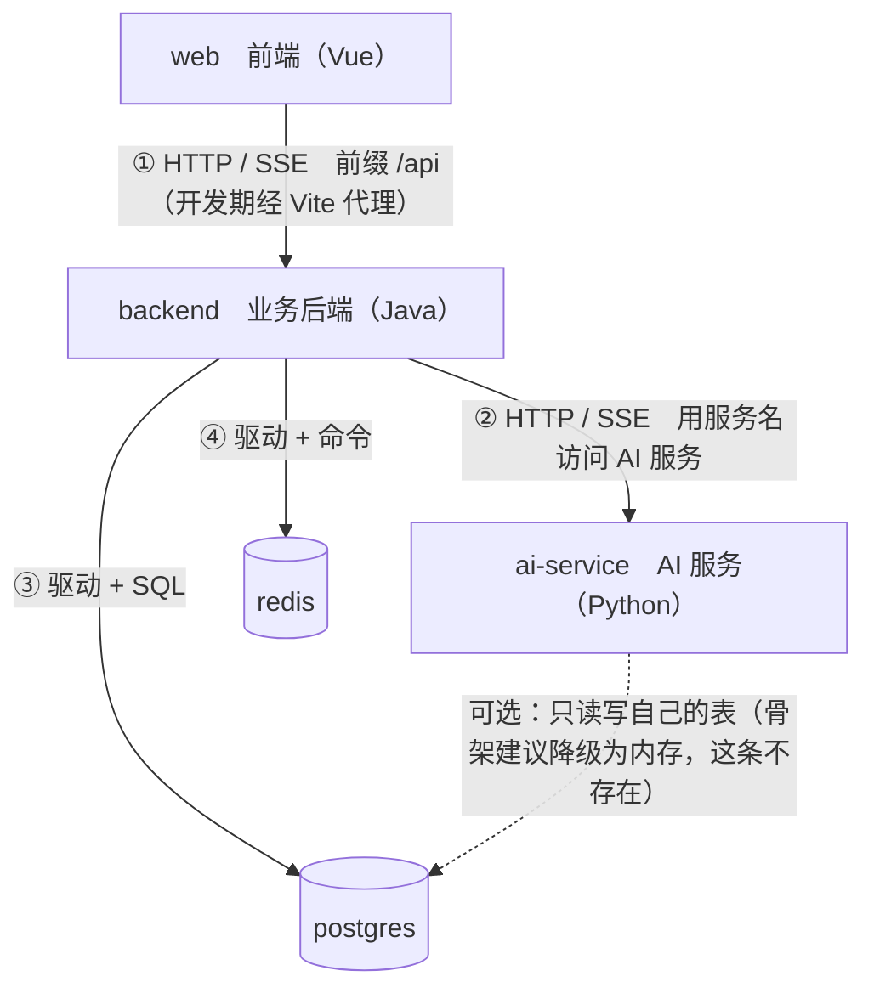

# MTC 模块依赖图

> **版本** v2.0 ｜ **日期** 2026-09-22 ｜ 生效版（接口相关以 `docs/接口契约.md` 为准）
> **用途**：一张图回答"**谁可以调谁、谁绝对不能调谁**"。
> **过关自检**：能指着这张图讲清"**为什么不能反向调**"——一旦出现回环，骨架就没法单独测试、单独替换。
> **注意**：本文讲的是"**调用关系**"（一个进程去用另一个进程），不是"接口字段"。字段级的东西看 `docs/接口契约.md`。

---

## 一、一张图（谁调谁）



**四层，一个方向**：

```
web ──HTTP/SSE──▶ backend ──HTTP──▶ ai-service
                     │
                     ▼
              postgres / redis
```

**读图要点**：**箭头只能从上往下、从左往右。** 图里没有一根箭头是反着画的，这就是骨架的边界。

---

## 二、允许的调用（一共只有这 4 条）

| # | 谁 → 谁 | 走什么 | 关键约定 |
| --- | --- | --- | --- |
| ① | 浏览器 → 后端 | HTTP / SSE，前缀 `/api`，开发期由 Vite 代理转发 | 浏览器**只认识一个域**（前端自己）；除登录和健康检查外必带 `Authorization` |
| ② | 后端 → AI 服务 | HTTP / SSE，用**服务名**访问 | 内网调用，**只有后端一个调用方**；**必带** `X-Trace-Id` 且与 body 的 `traceId` 相同 |
| ③ | 后端 → postgres / redis | 数据库驱动 + SQL / Redis 命令 | **只读写自己的表**；连接串用服务名，不写 IP |
| ④ | AI 服务 → postgres | 数据库驱动 + SQL（**可选**） | 只读写**自己的表**（独立 schema）；骨架建议用内存检查点 → **这条不存在** |

> ⚠️ 注意 ③④ 严格说**不是"接口"**：数据库和缓存没有"你问我答"的约定，你发指令它执行。真正算接口的只有 ①②。

---

## 三、绝对禁止的调用（出现任何一条，骨架就废了）

| 禁止 | 为什么不能这么做 |
| --- | --- |
| **浏览器 → AI 服务** | 鉴权会**绕过后端**，等于把门卫撤了；权限判断会出现两套规则 |
| **浏览器 → postgres / redis** | 等于把数据库直接暴露到公网 |
| **后端 → 浏览器（反向调用）** | 出现回环，且后端成了被前端驱动的一方，边界彻底乱掉 |
| **AI 服务 → 后端** | 出现**双向回环**：两个服务互相等，谁先挂都说不清，日志也没法串 |
| **AI 服务 → 业务表** | 两套代码改同一张表：权限、数据一致性、迁移脚本都没法收口 |
| **`common` / `config` → 任何业务模块** | 横切层一旦依赖业务，就**不能单独测试、不能单独替换**，会慢慢变成没人敢动的垃圾堆 |
| **`Service` → `Controller`（反向）** | 同上。业务规则应住在 Service，Controller 只做翻译 |
| **业务模块 **直接依赖**对方的内部实现**（Controller / Service 实现类 / Mapper） | 一方改内部结构，另一方就崩；且没法单独替换（**正确的共享方式见 4.5**） |

---

## 四、四条硬规则（背下来）

```
web ──HTTP/SSE──▶ backend ──HTTP──▶ ai-service
                     │
                     ▼
              common / config     ← 只能被依赖，不许依赖业务模块
```

1. **只能单向**：`Controller → Service → Repository / Mapper`，不能反向。
2. **`common` / `config` 只能被依赖**，不许反过来依赖 `auth` / `sample`。
3. **两个服务之间只能走接口**，不许互相直连对方的数据库。
4. **业务模块之间只允许通过"明确的模块接口"交互**，不许直接依赖对方的内部实现。

### ★4.5 规则 4 的修正说明（本次修订）

旧版本写的是"**业务模块之间不互相调用，要共享就下沉到 `common`**"。**这句话有两个问题**：

- "**要共享就下沉到 common**" —— 会让 `common` 变成**业务逻辑收容所**。放进去的业务代码会被所有人依赖，最后谁都不敢改。
- "**不互相调用**" —— 太绝对，实际上总有模块需要用到另一个模块的能力。

**修正后的分法**

| 要共享的东西 | 放哪 |
| --- | --- |
| **通用、稳定、与业务无关**的能力（统一返回、错误码、TraceId、通用工具） | `common` |
| **业务**能力 | ① 由拥有方提供**明确的模块接口**，调用方只依赖**接口**，不依赖实现 ② 或者抽成独立的业务模块 |

**`common` 的准入自检（三问，有一问答"是"就不许进）**

| # | 自问 | 是 → |
| --- | --- | --- |
| 1 | 它和**具体业务**有关吗？ | **不许进 `common`** |
| 2 | 改它会不会**牵动业务模块**？ | **不许进**（说明它不够通用） |
| 3 | 删掉它，会不会**有业务功能受影响**？ | **不许进**（说明它是业务，不是基础能力） |

**为什么这四条最重要**：一旦破掉任意一条，骨架就**不能单独测试、不能单独替换、也没法解释**——那它就不是骨架，只是一堆能跑的代码。

---

## 五、为什么不能反向调：三条后果

反向调用（回环）不是"风格问题"，是**三个具体能力会直接失效**：

1. **不能单独测试。** 想测 A，必须先起 B。B 没起，A 的测试就跑不了。
2. **不能单独替换。** 想换掉 AI 服务，会连带改后端——"AI 服务"这个独立单元就不成立了。
3. **解释不清。** 说不清"谁依赖谁"，就说不清"改这里会影响什么"。上会被追问时，这一条最致命。

**判断回环的办法**：在图上**用手指顺着箭头走一遍**。如果存在某条路径能从 A 出发又回到 A，那就是回环，说明**边界划错了**。

---

## 六、容器内怎么互相找到对方

| 事项 | 约定 |
| --- | --- |
| 服务互访地址 | **一律用服务名**（`backend` / `ai-service` / `postgres` / `redis`）。**任何地方不许写 IP** |
| 为什么 | 同一个内部网络里用服务名，换环境（本地 / 容器 / 服务器）都不用改代码 |
| 前端代理目标 | 本机开发指向本机后端；**容器内必须指向后端服务名**（容器里的 `localhost` 是它自己） |
| 对外暴露 | 骨架阶段为方便调试都映射到宿主机；**验收时 AI 服务只留后端可达** |

---

## 七、自检（三条都要能当场答）

1. 指着图，能讲清"**为什么不能反向调**"吗？
2. 从 `Controller` 到 `Mapper`，**有没有任何一处反向依赖**？
3. 图上每一条线，**它是"接口"还是"驱动"**，能分开说吗？

---

## 八、附：与方法文档的关系

本文只管"**谁可以调谁**"。至于"用什么技术、为什么不用另一个"，见 `docs/选型决策表.md`；"接口字段长什么样"，见 `docs/接口契约.md`。**三份文档各管一段，互相不替代。**
